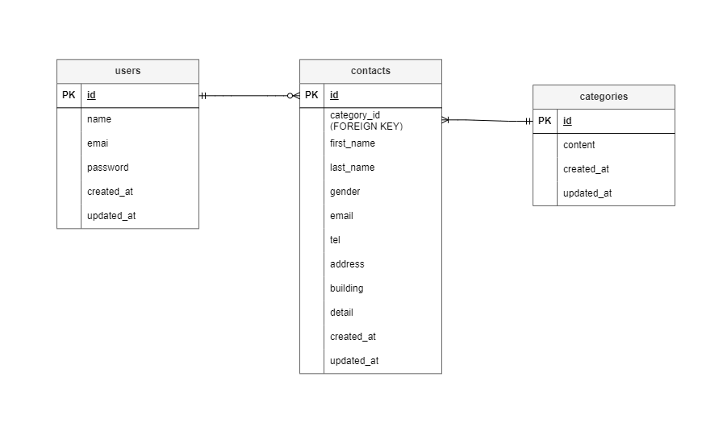

# お問い合わせフォーム

## 環境構築
- Docker ビルド
  1. リポジトリをクローン 
  `git clone git@github.com:kawamata-natsuki/contact-form-test.git`
  2. `docker-compose up -d --build`
  *MYSQLはOSによって起動しない場合があるので、それぞれのPCに合わせて `docker-compose.yml`ファイルを編集してください

- Laravel 環境構築
  1. `docker-compose exec php bash`
  2. `composer install`
  3. `.env.example`ファイルから`.env`を作成する `cp .env.example .env`
  4. `php artisan key:generate`
  5. `php artisan migrate`
  6. `php artisan db:seed`
  
## 使用技術(実行環境)
- Laravel Framework 8.83.29
- PHP 8.4.3
- MYSQL 8.0.26
- Nginx 1.21.1
- phpMyAdmin 8.2.27

## ER図

## URL
- 開発環境：http://localhost/
- データベース： http://localhost:8080